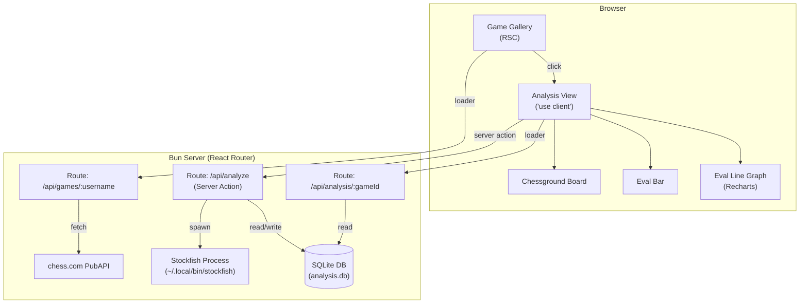

# Chess Analysis App — Implementation Plan

## Architecture Overview

This is a **local-only app** — Stockfish runs as a subprocess, so a backend server process is mandatory. The cleanest fit for your stack: **React Router v7 (framework mode)** running on **Bun**, with its built-in SQLite for the analysis cache.



---

## Phase 1 — Scaffold

```bash
bunx create-react-router@latest chess-analyzer --template bun
cd chess-analyzer
bun add @lichess-org/chessground chess.js @chess-com/pgn-parser recharts
bun add -d @types/bun
```

**Key config additions:**
- `vite.config.ts`: Add `optimizeDeps: { exclude: ['@lichess-org/chessground'] }` (it ships its own ESM)
- Import chessground's base CSS in `app/root.tsx`:
  ```ts
  import "@lichess-org/chessground/assets/chessground.base.css";
  import "@lichess-org/chessground/assets/chessground.brown.css";
  import "@lichess-org/chessground/assets/chessground.cburnett.css";
  ```

---

## Phase 2 — Database Schema (Bun SQLite)

```ts
// app/lib/db.server.ts
import { Database } from "bun:sqlite";

export const db = new Database("analysis.db", { create: true });

db.run(`
  CREATE TABLE IF NOT EXISTS games (
    id TEXT PRIMARY KEY,
    username TEXT NOT NULL,
    pgn TEXT NOT NULL,
    white TEXT,
    black TEXT,
    result TEXT,
    time_class TEXT,
    end_time INTEGER,
    created_at INTEGER DEFAULT (unixepoch())
  )
`);

db.run(`
  CREATE TABLE IF NOT EXISTS analysis (
    game_id TEXT NOT NULL,
    move_index INTEGER NOT NULL,
    fen TEXT NOT NULL,
    move_san TEXT,
    score_cp INTEGER,   -- centipawns (null if mate)
    score_mate INTEGER, -- mate in N (null if cp)
    best_move TEXT,
    depth INTEGER,
    PRIMARY KEY (game_id, move_index),
    FOREIGN KEY (game_id) REFERENCES games(id)
  )
`);
```

---

## Phase 3 — Chess.com API + Game Loader

```ts
// app/lib/chesscom.server.ts
// No auth needed — chess.com PubAPI is fully public
// Ref: https://chess.com/news/view/published-data-api

export async function fetchArchives(username: string) {
  const r = await fetch(
    `https://api.chess.com/pub/player/${username}/games/archives`,
    { headers: { "User-Agent": "chess-analyzer/1.0" } }
  );
  const { archives } = await r.json();
  return archives as string[]; // e.g. ["https://api.chess.com/pub/player/hikaru/games/2026/02"]
}

export async function fetchMonthGames(archiveUrl: string) {
  const r = await fetch(archiveUrl, {
    headers: { "User-Agent": "chess-analyzer/1.0" },
  });
  const { games } = await r.json();
  return games;
}
```

**Gallery route (`app/routes/home.tsx`):**
- Server loader fetches last 3 months of archives → upserts into `games` table
- Client renders searchable grid (filter by opponent, result, time class)
- Game card shows: players, result badge, time control, date

---

## Phase 4 — Stockfish Analysis Service

```ts
// app/lib/stockfish.server.ts
// UCI protocol over stdin/stdout via Bun.spawn

export async function analyzeGame(
  gameId: string,
  fens: string[]
): Promise<void> {
  const proc = Bun.spawn(
    ["/home/ian/.local/bin/stockfish"],
    { stdin: "pipe", stdout: "pipe" }
  );

  const writer = proc.stdin.getWriter();
  const reader = proc.stdout.getReader();

  const sendCmd = async (cmd: string) => {
    await writer.write(new TextEncoder().encode(cmd + "\n"));
  };

  await sendCmd("uci");
  await sendCmd("setoption name Threads value 4");
  await sendCmd("setoption name Hash value 128");
  await sendCmd("isready");

  for (let i = 0; i < fens.length; i++) {
    await sendCmd(`position fen ${fens[i]}`);
    await sendCmd("go depth 20");
    // Read lines until "bestmove" response
    const { score, bestMove } = await readUntilBestMove(reader);
    // Upsert into analysis table
    db.run(
      `INSERT OR REPLACE INTO analysis
         (game_id, move_index, fen, score_cp, score_mate, best_move, depth)
       VALUES (?, ?, ?, ?, ?, ?, 20)`,
      [gameId, i, fens[i], score.cp ?? null, score.mate ?? null, bestMove]
    );
  }

  await writer.close();
  proc.kill();
}
```

**UCI parsing:** Parse `info depth 20 score cp 34` or `info depth 20 score mate 3` lines. Take the **last `info` line** before `bestmove` as the final evaluation.

**Score normalization:** Always from White's perspective (cp / 100 = pawns).

---

## Phase 5 — Analysis Route

```
app/routes/analysis.$gameId.tsx
```

**Loader:**
1. Look up game PGN from DB
2. Check if analysis exists for all moves → if not, trigger `analyzeGame()` (server action / streaming response)
3. Return `{ game, analysis, fens }` to client

**PGN → FEN array** using `chess.js`:

```ts
import { Chess } from "chess.js";

export function pgnToFens(pgn: string): string[] {
  const chess = new Chess();
  chess.loadPgn(pgn);
  const history = chess.history({ verbose: true });
  const fens: string[] = [];
  const c2 = new Chess();
  fens.push(c2.fen()); // starting position
  for (const move of history) {
    c2.move(move);
    fens.push(c2.fen());
  }
  return fens;
}
```

---

## Phase 6 — Analysis UI

### Layout

```
┌──────────────────────────────────────────────────────┐
│  ← Back    White vs Black    Result    Time Control   │
├──────────┬──────────────────────────┬────────────────┤
│  Eval    │                          │                 │
│  Bar     │    Chessground Board     │  Move List      │
│  (vert)  │                          │  (scrollable)   │
├──────────┴──────────────────────────┴────────────────┤
│           Evaluation Line Graph (Recharts)            │
└──────────────────────────────────────────────────────┘
```

### Chessground wrapper

```tsx
// app/components/ChessBoard.tsx
"use client";
import { useEffect, useRef } from "react";
import { Chessground } from "@lichess-org/chessground";
import type { Api } from "@lichess-org/chessground/api";
import type { Config } from "@lichess-org/chessground/config";

export function ChessBoard({ fen, lastMove, config }: {
  fen: string;
  lastMove?: [string, string];
  config?: Partial<Config>;
}) {
  const ref = useRef<HTMLDivElement>(null);
  const api = useRef<Api | null>(null);

  useEffect(() => {
    if (!ref.current) return;
    api.current = Chessground(ref.current, {
      fen,
      lastMove,
      movable: { free: false },
      draggable: { enabled: false },
      selectable: { enabled: false },
      ...config,
    });
    return () => api.current?.destroy();
  }, []);

  useEffect(() => {
    api.current?.set({ fen, lastMove });
  }, [fen, lastMove]);

  return <div ref={ref} className="size-full aspect-square" />;
}
```

### Eval Bar

```tsx
// Vertical bar, white on bottom
// score clamped to [-10, 10] pawns → 0–100% height
const clampedScore = Math.max(-10, Math.min(10, scorePawns));
const whiteHeight = ((clampedScore + 10) / 20) * 100;
```

### Eval Graph

```tsx
// app/components/EvalGraph.tsx
"use client";
import { LineChart, Line, ReferenceDot, Tooltip, XAxis, YAxis, ResponsiveContainer } from "recharts";

// Inflection points: |score[i] - score[i-1]| > 0.5 pawns
// Render as larger dots using <ReferenceDot> for each inflection
```

**Inflection click** → `setCurrentMove(index)` → board jumps to that FEN.

### Keyboard navigation

```tsx
useEffect(() => {
  const handler = (e: KeyboardEvent) => {
    if (e.key === "ArrowRight") setMove((m) => Math.min(m + 1, maxMove));
    if (e.key === "ArrowLeft") setMove((m) => Math.max(m - 1, 0));
  };
  window.addEventListener("keydown", handler);
  return () => window.removeEventListener("keydown", handler);
}, [maxMove]);
```

---

## Phase 7 — Analysis Progress (SSE Streaming)

Since Stockfish analysis on a full game can take 30–60 seconds, stream progress back to the client:

```ts
// app/routes/api.analyze.$gameId.ts
export async function loader({ params }) {
  const stream = new ReadableStream({
    async start(controller) {
      for (let i = 0; i < fens.length; i++) {
        const result = await analyzePosition(fens[i]);
        controller.enqueue(
          `data: ${JSON.stringify({ moveIndex: i, ...result })}\n\n`
        );
      }
      controller.close();
    },
  });
  return new Response(stream, {
    headers: { "Content-Type": "text/event-stream" },
  });
}
```

Client uses `EventSource` to consume this stream, updating a progress bar and storing results locally until complete.

---

## File Structure

```text
chess-analyzer/
├── app/
│   ├── lib/
│   │   ├── db.server.ts          # Bun SQLite setup
│   │   ├── chesscom.server.ts    # Chess.com PubAPI
│   │   ├── stockfish.server.ts   # UCI subprocess
│   │   └── pgn.ts               # PGN → FEN utils (chess.js)
│   ├── components/
│   │   ├── ChessBoard.tsx        # Chessground wrapper
│   │   ├── EvalBar.tsx           # Vertical evaluation bar
│   │   ├── EvalGraph.tsx         # Recharts line graph
│   │   └── GameCard.tsx          # Gallery card
│   ├── routes/
│   │   ├── home.tsx              # Game gallery (RSC loader)
│   │   ├── analysis.$gameId.tsx  # Analysis view
│   │   └── api.analyze.$gameId.ts # SSE Stockfish stream
│   └── root.tsx
├── analysis.db                   # SQLite (gitignored)
└── package.json
```

---

## Key Gotchas

| Issue | Solution |
|---|---|
| Chessground is GPL-3.0 | Fine for personal local use; can't redistribute closed-source |
| Chessground has no chess logic | Use `chess.js` for legal move generation, FEN building |
| Stockfish path hardcoded | Env var `STOCKFISH_PATH` defaulting to `~/.local/bin/stockfish` |
| Chess.com CORS | All fetches go through the Bun server, not the browser |
| `@lichess-org/chessground` v10 | New scoped package (Jan 2026) — use this, not the old `chessground` package |
| Analysis re-runs | Check `COUNT(*)` in analysis table before spawning Stockfish — skip if already complete |
